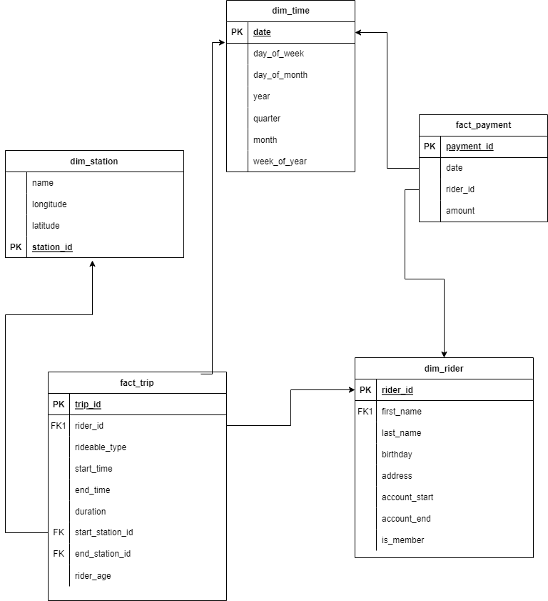
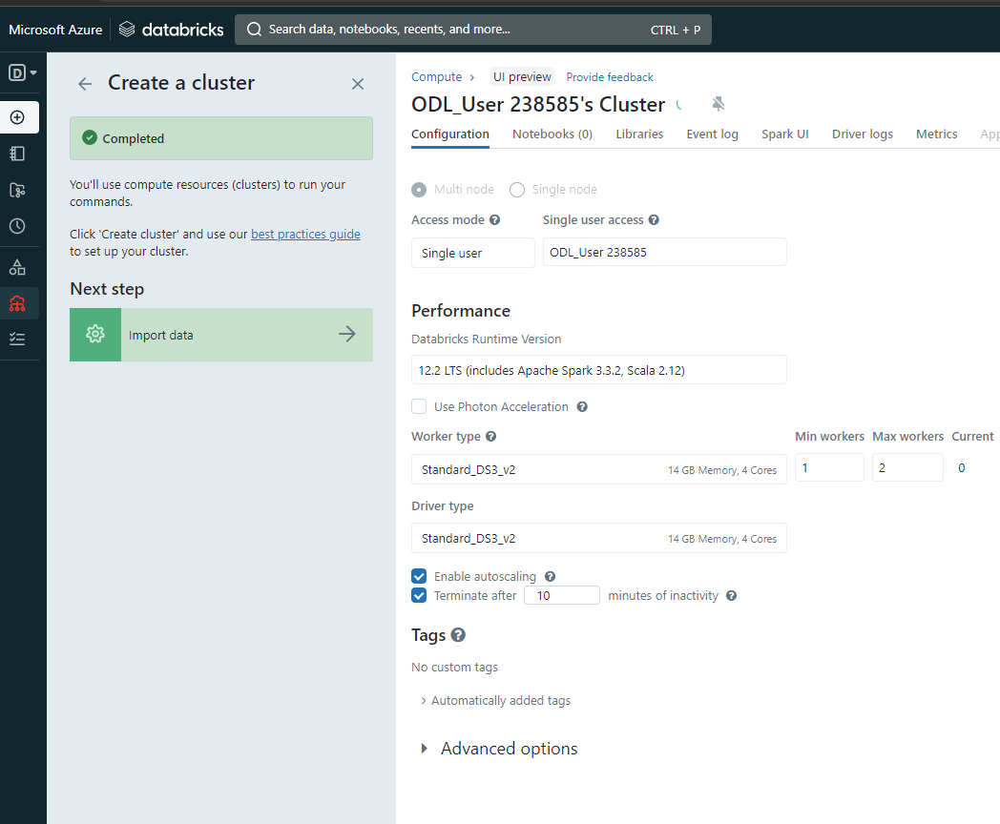
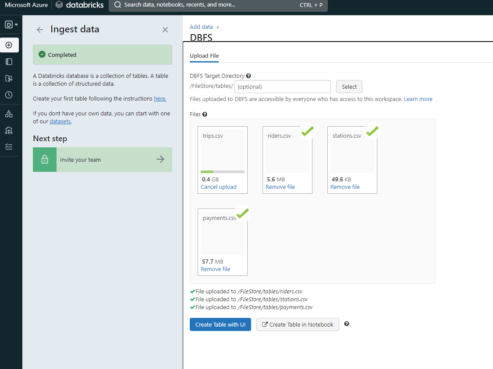
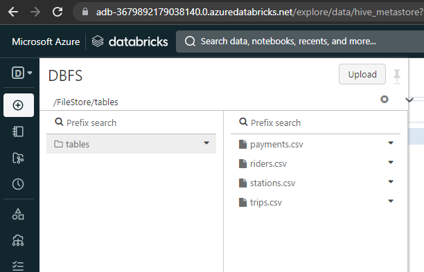
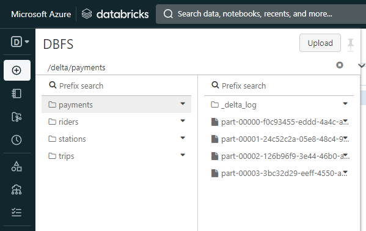
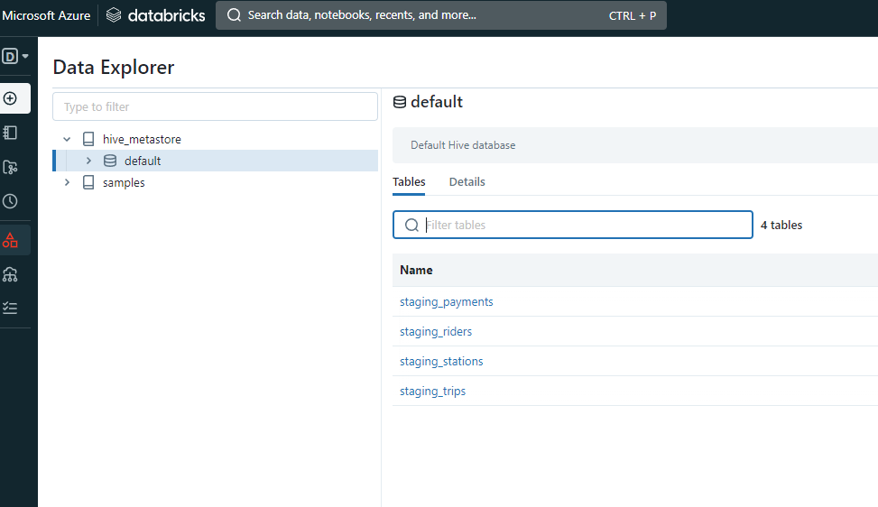
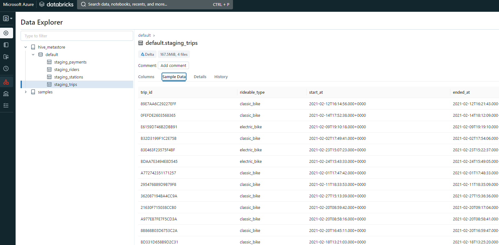
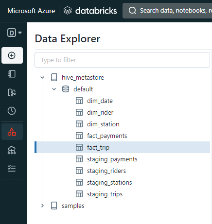
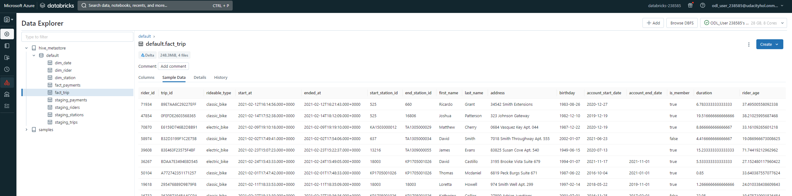

# azure-project3
# Joeri Vlieghe
Data engineering with Azure nanodegree- project 3: Building an Azure Data Lake for Bike Share Data Analytics

### Project Description

In this project, you'll build a data lake solution for Divvy bikeshare.

Divvy is a bike sharing program in Chicago, Illinois USA that allows riders to purchase a pass at a kiosk or use a mobile application to unlock a bike at stations around the city and use the bike for a specified amount of time. The bikes can be returned to the same station or to another station. The City of Chicago makes the anonymized bike trip data publicly available for projects like this where we can analyze the data.

The goal of this project is to develop a data lake solution using Azure Databricks using a lake house architecture. You will:

- Task 1: Design a star schema based on the business outcomes listed below;
- Task 2: Import the data into Azure Databricks using Delta Lake to create a Bronze data store;
- Task 3: Create a gold data store in Delta Lake tables;
- Task 4: Transform the data into the star schema for a Gold data store;

# Tasks

### Task 1: Design a star schema based on the business outcomes listed below

The star schema I designed is the following:

### Task 2: Import the data into Azure Databricks using Delta Lake to create a Bronze data store

I created a databricks workspace and cluster:

And then imported the file into the DBFS filesystem:

All files are available:

I then loaded the .csv files into the delta lake using the scrips in the /load_delta folder

### Task 3: Create a gold data store in Delta Lake tables

I then used the script in the create_tables folder to load the tables from Delta into SQL tables and thus creating a gold data store.

As an example I previewed the staging_trips table:

### Task 4: Transform the data into the star schema for a Gold data store

For Task 4 I used the scripts in the gold_transform folder to convert the staging tables to the tables in the star schema.

All tables created:

As example I took the created fact_trip table, which shows the table with all required columns

